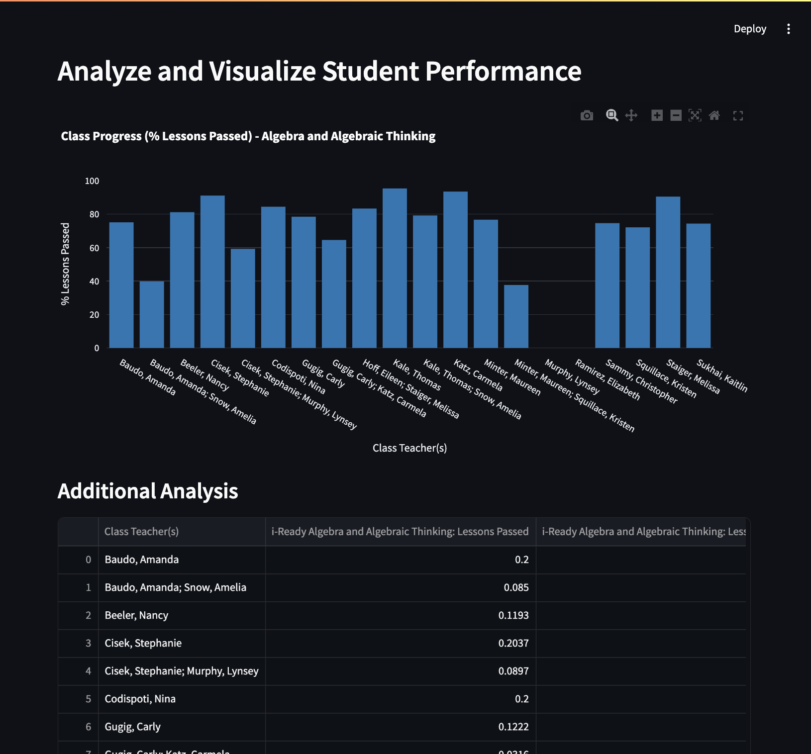
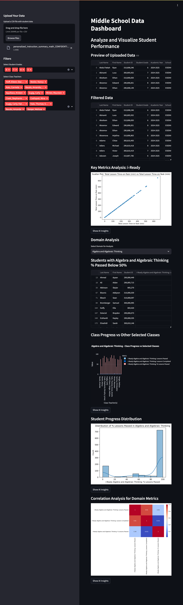
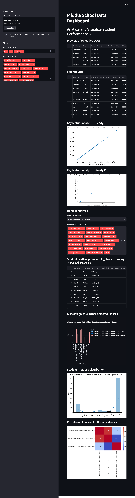
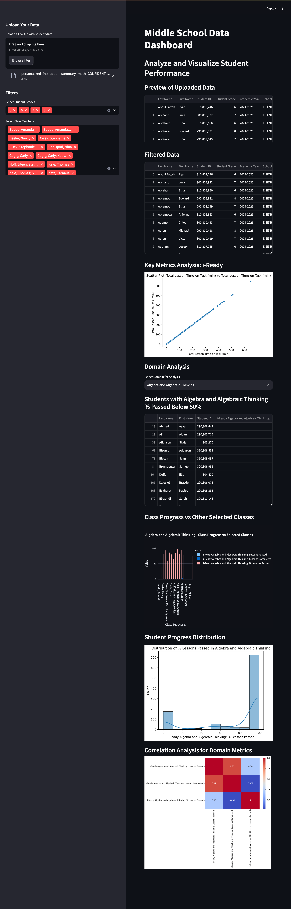
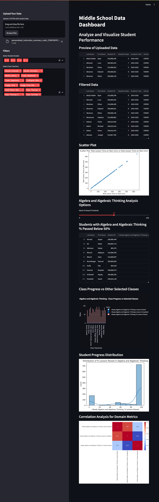

# School Testing Data Dashboard

This is an interactive Streamlit dashboard for analyzing school testing data.

## Features
- Upload and filter CSV data by grade and score ranges.
- Visualize data with bar charts, scatter plots, and more.
- Export filtered data for further analysis.

## How to Run
1. Install dependencies:
2. Run the app:

## Sample Data
A sample dataset is provided in the `data/sample.csv` file.

## File Descriptions and Screenshots

### 1.py
- **Description:** Analyze and visualize student performance: class progress on domains. Identifies Ss failing domain
- **Screenshot:**
  

### 2.py
- **Description:** Analyze and visualize student performance: Key Metrics Analysis: i-ready; Domain Analysis; ID failing Ss in Domain; Class progress w/ Selected classes; Student Progress List; Correlation Analysis Domain Heatmap.
- **Screenshot:**
  

### 3.py
- **Description:** Generates charts and visualizations.
- **Screenshot:**
  

### 4.py
- **Description:** H4.py - Analyze and visualize student performance: Key Metrics Analysis: i-ready; i-Ready Pro; Domain Analysis; ID failing Ss in Domain; Class progress w/ Selected classes; Student Progress List; Correlation Analysis Domain Heatmap.
- **Screenshot:**
  

### 5.py
- **Description:** Includes utilities for exporting data.
- **Screenshot:**
  

### 6.py
- **Description:** Finalizes the dashboard and user interface.
- **Screenshot:**
  
